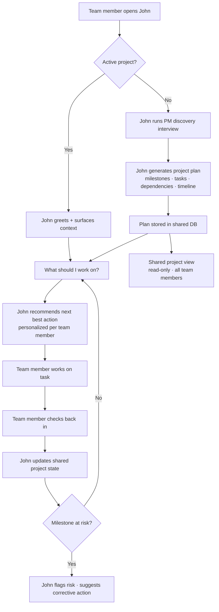

# John the PM — Vibe Project Management

## Problem Frame

Engineering teams using AI to build software ("vibe coding") still rely on human PMs or ad-hoc tools to manage the work. There is no equivalent AI-native PM experience. John the PM fills that gap: an AI project manager that runs discovery, generates project plans, tracks progress through conversation, and tells each team member what to work on next — without standups, Jira tickets, or a dedicated PM.

The target user is any engineer or small engineering team that wants to ship product without project management overhead. The framing: *engineers fighting back against PMs who are learning to vibe code.*

## User Flow

## Requirements

**Project Planning**

- R1. John initiates project setup through a PM-style discovery conversation — asking about goals, scope, team, constraints, and timeline — before generating any plan.
- R2. From discovery, John produces a structured project plan: milestones with dates, tasks with owners and dependencies, and a rough timeline.
- R3. The project plan is stored centrally in a shared database, not in local files or individual repos.
- R4. *(Deferred to v2)* Multi-project support. In v1, each team has exactly one active project.

**Task Management & Orchestration**

- R5. John assigns tasks to specific team members. No two team members are assigned the same task.
- R6. Team members update task status (in progress, blocked, done) through natural conversation with John — no form or ticket UI required.
- R7. When a task is reported as blocked, John prompts for the blocker and adjusts recommendations accordingly.
- R8. John proactively flags when a milestone is at risk based on current task progress.

**Next Best Action**

- R9. Any team member can ask John "what should I work on?" and receive a prioritized recommendation based on current project state, dependencies, and their assigned tasks.
- R10. Recommendations are personalized — John considers what each specific team member is responsible for and what is currently unblocked.

**Team Visibility**

- R11. A shared project view shows: overall project health, milestone status, who owns what, and what is currently in progress. This replaces the async standup.
- R12. The shared view reflects current project state without requiring manual action by any team member (implementation approach — polling, websocket, etc. — is deferred to planning).

**Reporting**

- R13. John generates a status summary on demand (e.g. "give me a project update") in plain language. The summary can be scoped to a standup-style digest format: what each team member worked on, what's next, and any blockers.

## Success Criteria

- A developer can go from "I want to build X" to a structured project plan in a single conversation with John.
- Any team member can start their workday by asking John "what should I work on?" and receive a clear, dependency-aware answer.
- No two team members are ever assigned the same task.
- The shared project view reflects up-to-date state from all 1:1 conversations without manual syncing.
- A team can replace their daily standup with John's digest.

## Scope Boundaries

- No external third-party integrations in v1 (Granola, ClickUp, GitHub, Jira, Linear, Slack). John's own database is not an "integration" — it is the app's internal persistence layer.
- No shared team chat channel in v1 — each member has a 1:1 with John; the shared project view is read-only.
- No time tracking or time logging.
- No billing, payments, or admin console.
- No mobile app — web only.

## Key Decisions

- **Markdown files are not the persistence layer**: State must be centralized for multi-user shared access. Markdown may be used for exports or AI context formatting internally, but is not the source of truth.
- **1:1 chat first, shared channel later**: Individual conversations with John are the primary interaction model. The shared view is read-only in v1.
- **Full loop from day one**: John must support plan generation, progress tracking, and next-best-action recommendations together. A partial PM experience is not the goal.
- **Conversation is the UI**: No ticket forms, no drag-and-drop boards. All interaction happens through natural language chat.
- **One project per team in v1**: Each team workspace has exactly one active project. Multi-project support is explicitly deferred to v2 to keep the data model and nav simple.
- **Magic link authentication**: Passwordless email sign-in. No passwords to manage, low implementation overhead for v1.

## Dependencies / Assumptions

- John is powered by an LLM API (provider TBD in planning).
- John needs persistent memory across sessions — conversation history and project state must survive between logins.
- Authentication is required; users belong to a team/workspace.

## Outstanding Questions

### Resolve Before Planning

*(None — all blocking questions resolved.)*

### Deferred to Planning

- **[Affects R3][Technical]** What database and backend stack powers John's shared state?
- **[Affects R2, R9][Technical]** How does John maintain memory and project context across conversations — what persistence strategy works with the chosen LLM?
- **[Affects R11][Technical]** How is the shared project view implemented — server-rendered page, real-time websocket, polling?
- **[Affects R1][Needs research]** What discovery questions make for the best PM-quality project plans? Worth researching PM frameworks (RICE, MoSCoW, etc.) to inform John's interview script.

## Next Steps

→ `/ce:plan` for structured implementation planning.
