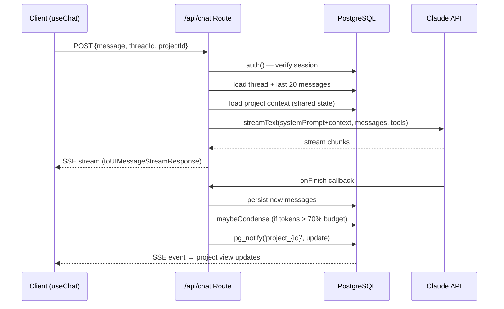
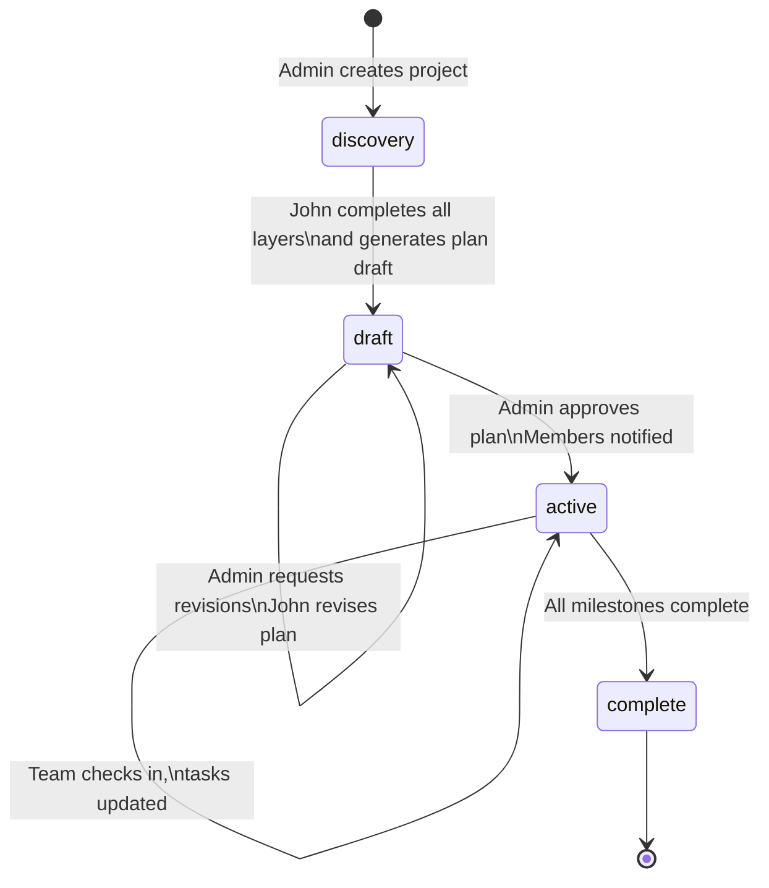
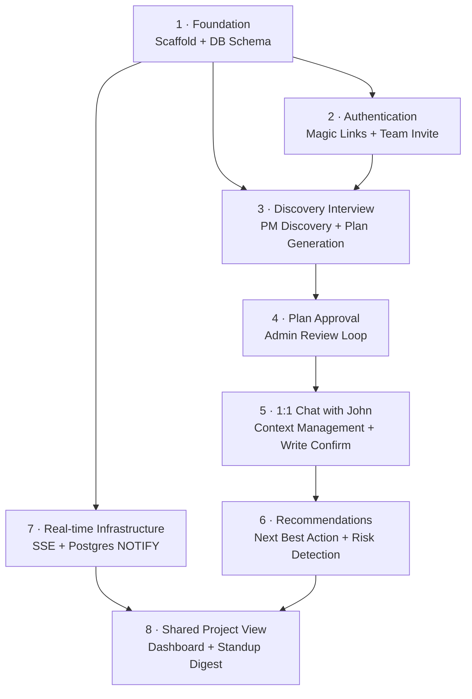

# feat: John the PM — Core Application

## Overview

Build "john-the-pm" from scratch: a web application that acts as an AI project manager for engineering teams. Engineers describe what they want to build; John runs PM-style discovery, generates a structured project plan, tracks progress through 1:1 conversation, recommends next best actions, and maintains a shared read-only project view for the team — replacing standups and manual PM work with an AI-native loop.

## Problem Frame

Engineering teams building with AI (vibe coding) still rely on human PMs or ad-hoc markdown files to manage project work. There is no AI-native PM experience. John fills that gap. The target user is an engineer or small engineering team that wants to ship without PM overhead. (see origin: docs/brainstorms/2026-04-01-vibe-pm-requirements.md)

## Requirements Trace

- R1. John initiates project setup through PM-style discovery conversation
- R2. John produces a structured project plan: milestones, tasks, dependencies, timeline
- R3. Project plan stored centrally in a shared database
- R5. John assigns tasks; no two members assigned the same task
- R6. Task status updated through natural conversation, not forms
- R7. John confirms task updates before writing; prompts for blockers
- R8. John proactively flags milestone risk
- R9. Any member can ask "what should I work on?" and get a prioritized answer
- R10. Recommendations are personalized per team member
- R11. Shared project view: health, milestones, ownership, in-progress work
- R12. Shared view reflects current state without manual action
- R13. John generates status summaries and standup-style digests on demand

## Scope Boundaries

- No external integrations (GitHub, Jira, Slack, Granola, ClickUp) — Resend for email is infrastructure, not an integration
- No shared team chat channel — 1:1 with John only; shared view is read-only
- No time tracking, billing, mobile app, or admin console
- Multi-project support deferred to v2; use a `status` flag (not a unique constraint) so v2 doesn't require schema migration (see origin: key decision)

## Context & Research

### Technology Stack

- **Framework**: Next.js 15 (App Router) + TypeScript
- **AI**: Vercel AI SDK **v5** (`ai@5.x` + `@ai-sdk/react@5.x` + `@ai-sdk/anthropic`) — uses `sendMessage`/`transport`/`DefaultChatTransport` API (v5 breaking change from v4's `handleSubmit`/`append`/`api:` prop). Pin exact v5 minor versions — do not use v4.
- **LLM**: Claude via Anthropic provider (claude-sonnet-4-6 for main chat, claude-haiku-4-5 for summarization)
- **Database**: PostgreSQL via Prisma ORM + `PrismaPg` adapter
- **Auth**: Auth.js v5 (`next-auth@beta`) + Resend email provider + `@auth/prisma-adapter`
- **Real-time**: Server-Sent Events (SSE) + per-connection Postgres `LISTEN`/`NOTIFY` — each SSE connection opens its own `pg.Client`, no module-level singleton (incompatible with Vercel serverless)
- **Deployment target**: Vercel (shapes SSE and connection-pooling decisions)

### Relevant Code and Patterns

- Greenfield project — no existing code. All patterns sourced from external research.
- Next.js 15 breaking change: `cookies()`, `headers()`, `params` are now async — must `await` them everywhere
- Auth.js v5: single `auth.ts` config file replaces `pages/api/auth/[...nextauth].ts`; requires `strategy: 'database'` for magic link email provider
- Prisma singleton pattern required in Next.js to prevent connection exhaustion on hot-reload
- AI SDK v4 streaming: use `result.toUIMessageStreamResponse()` in route handlers; `onFinish` callback is the correct place to persist messages (not during the stream)
- Vercel serverless: SSE works via `ReadableStream`; long-lived WebSocket connections are not supported; add `export const runtime = 'nodejs'` to SSE route handlers

### Institutional Learnings

- No existing `docs/solutions/` — greenfield project.

### External References

- Vercel AI SDK v4 docs: `useChat` with `DefaultChatTransport`, `convertToModelMessages`, `Output.object()`
- Auth.js v5: `authjs.dev` — Resend provider, Prisma adapter, database sessions
- Postgres LISTEN/NOTIFY as lightweight pub/sub (no Redis needed for <~500 concurrent users)
- Summary buffer memory strategy: verbatim last-N messages + LLM-compressed summary of older context
- `SELECT FOR UPDATE SKIP LOCKED` for atomic task claiming (standard PostgreSQL job-queue pattern)

## Key Technical Decisions

- **AI SDK v5 with `sendMessage`/`transport`**: The v5 API differs significantly from v4 (`sendMessage` replaces `append`, `transport: new DefaultChatTransport({...})` replaces `api: '...'`). Using v5 from the start avoids a migration. Pin `ai@5.x` and `@ai-sdk/react@5.x` in `package.json`. The `useChat` hook's `messages` prop (renamed from `initialMessages` in v4) hydrates conversation history from the server on page load.

- **Summary buffer context strategy**: Each 1:1 thread stores verbatim recent messages (last ~20) plus an LLM-generated summary of older context. When input tokens exceed ~70% of the budget (140k of Claude Sonnet 4-6's 200k window), older messages are summarized. Summarized messages are **not deleted** — they are marked with a `summarized: true` flag in the DB and excluded from context assembly but remain accessible for the `messages` hydration query (so users can scroll back). The summarization prompt explicitly instructs the LLM to omit task statuses and project state facts from the summary (those are always re-loaded fresh from the DB into the system prompt). Full history replay is explicitly rejected.

- **Structured project state in system prompt, not in message history**: John reads the project's shared `context` JSONB column and injects it as part of the system prompt on every request — not as user/assistant messages. This is what gives each team member's conversation access to shared project state without cross-contaminating private threads.

- **SSE + Postgres LISTEN/NOTIFY (per-connection client, not module-level singleton)**: Each SSE connection opens its own dedicated `pg.Client`, runs `LISTEN` on the project's channel, and tears down cleanly on disconnect. A module-level singleton cannot work on Vercel — serverless function instances are ephemeral and not shared across concurrent requests, so a singleton would not receive `pg_notify` events fired by other instances. A per-connection client solves this: the SSE route handler lives for the duration of the HTTP connection (long-lived streaming response on Vercel Node.js runtime), and the pg.Client lives alongside it. Connection budget: ~1 LISTEN connection per active dashboard viewer. For team-scale loads this is acceptable; specify `export const maxDuration = 800` on the SSE route (Vercel Pro/Enterprise) to prevent default 60s timeout.

- **Optimistic locking for project state (version column)**: The `projects` table has a `version` integer column. Updates use `WHERE version = :expected` and increment on success. Retried up to 3 times with small backoff. This prevents silent overwrites when two users' John conversations update shared state concurrently.

- **`SELECT FOR UPDATE SKIP LOCKED` for task assignment only**: Atomic task claiming at the DB level, used exclusively when assigning tasks at plan approval time. Application-level checks are insufficient. `SKIP LOCKED` is the right primitive for "one winner claims the row" semantics. It is explicitly NOT used for task status updates (where it would silently discard writes if another transaction holds the lock) — those use optimistic locking instead.

- **DB-level content hash for task deduplication**: A `content_hash` computed column (`md5(lower(title) || '::' || project_id)`) with a unique index prevents John from creating the same task twice across concurrent conversations. On unique constraint violation, return the existing task rather than an error.

- **Admin + invite role model**: Two roles — `admin` and `member`. Admin creates the team, runs discovery, approves the plan, and manages invitations. Members can check in with John and view the project. Roles are stored in a `team_members` join table, not on the user record directly (users can be admin of one team and member of another in v2).

- **Plan approval loop before publish**: After discovery, John generates a draft plan visible only to admin. Admin can ask John to revise sections via chat before explicitly approving. Only after approval does the plan become shared project state visible to members. This prevents teams from being assigned work from an incorrect plan.

- **Confirm before writing**: John always states its intended DB write in natural language and waits for user confirmation before executing. This applies to task status changes, blocker updates, and any mutation to shared project state. Silent writes are rejected as an option.

- **One active project per team in v1 — enforced by `status` flag, not unique constraint**: The `projects` table uses a `status` column (`discovery | draft | active | complete | archived`). Application logic enforces one active project per team. The schema supports multiple projects per team (for v2) without migration.

## Open Questions

### Resolved During Planning

- **LLM provider**: Anthropic Claude (claude-sonnet-4-6 for chat, claude-haiku-4-5 for summarization). Vercel AI SDK's `@ai-sdk/anthropic` provider.
- **Real-time mechanism**: SSE + Postgres LISTEN/NOTIFY. No Redis in v1.
- **Session duration**: 7 days. On expiry, member is redirected to request a new magic link. Conversation history is preserved in DB and resumes on re-auth.
- **Context window strategy**: Summary buffer — last 20 messages verbatim + LLM-generated summary of older history + structured project state in system prompt.
- **Email provider**: Resend. This is infrastructure (not a product integration) and is in scope for v1.
- **Discovery termination**: John decides when sufficient information has been gathered across the DISCOVERY_LAYERS sequence and offers to generate the plan. Interview state is persisted in the project record so it can be resumed if interrupted.
- **Project state schema**: Tasks have title, description, assignee_id, status, priority, milestone association, due date, and dependency IDs. Milestones have title, target_date, and status. See data model in High-Level Technical Design.
- **Member removal**: Tasks are unassigned (not deleted). Conversation history is soft-deleted (retained in DB, inaccessible in-app). Membership row is removed.
- **Empty state for pre-plan members**: If a member arrives before the plan is published, John informs them setup is in progress and prompts them to check back.

### Deferred to Implementation

- Exact Claude system prompt text and discovery question phrasing — requires iteration during implementation.
- Summarization trigger threshold — start at 70% of token budget; tune based on observed costs.
- SSE reconnection behavior edge cases — `EventSource` handles exponential backoff automatically; custom handling only if browser default proves insufficient.
- Pagination strategy for message history if message table grows very large — premature to specify now; default Prisma queries with `orderBy createdAt` and `take` will be sufficient for v1.

## High-Level Technical Design

> *This illustrates the intended approach and is directional guidance for review, not implementation specification. The implementing agent should treat it as context, not code to reproduce.*

### Data Model

```
teams
  id, name, created_at

users (Auth.js compatible)
  id, email, email_verified, name, image, created_at

team_members
  team_id → teams.id
  user_id → users.id
  role: 'admin' | 'member'
  joined_at
  UNIQUE(team_id, user_id)

projects
  id, team_id → teams.id
  name, objective
  status: 'discovery' | 'draft' | 'active' | 'complete' | 'archived'
  context JSONB         -- shared project state (decisions, risks, blockers)
  plan JSONB            -- full structured plan artifact
  version INTEGER       -- optimistic locking
  created_at, updated_at

milestones
  id, project_id → projects.id
  title, target_date, status: 'not_started' | 'in_progress' | 'at_risk' | 'complete'

tasks
  id, project_id → projects.id
  milestone_id → milestones.id (nullable)
  title, description
  assignee_id → users.id (nullable)
  status: 'unassigned' | 'assigned' | 'in_progress' | 'blocked' | 'complete'
  priority: 'critical' | 'high' | 'medium' | 'low'
  depends_on UUID[]     -- array of task IDs
  due_date (nullable)
  content_hash TEXT GENERATED ALWAYS AS (md5(lower(title)||'::'||project_id::text||'::'||COALESCE(milestone_id::text,''))) STORED
  -- Note: Prisma cannot model GENERATED ALWAYS AS STORED — apply via raw SQL in migration
  -- Unique index on content_hash alone (project_id + milestone_id already embedded)
  UNIQUE INDEX(content_hash)
  version INTEGER       -- optimistic locking for task updates

threads
  id, project_id → projects.id, user_id → users.id
  summary TEXT          -- LLM-generated rolling summary (excludes project state facts — those reload fresh)
  summary_at INTEGER    -- message count at last summarization
  pending_proposal JSONB -- proposed write awaiting user confirmation (null if none pending)
  UNIQUE(project_id, user_id)

messages
  id, thread_id → threads.id
  role: 'user' | 'assistant' | 'tool'
  content JSONB         -- AI SDK message parts array
  token_count INTEGER
  summarized BOOLEAN DEFAULT false  -- excluded from context assembly but retained for history display
  created_at
  INDEX(thread_id, created_at)

invitations
  id, team_id → teams.id
  email, token (hashed), expires_at, accepted_at (nullable)
  INDEX(token), INDEX(team_id, email)

-- Auth.js required: Account, Session, VerificationToken
```

### Request Flow — 1:1 Chat with John



### Discovery State Machine



### Implementation Unit Dependency Graph



## Implementation Units

- [ ] **Unit 1: Foundation — Project Scaffold + Database Schema**

**Goal:** Working Next.js 15 app with full database schema, Prisma client, and environment config. All subsequent units build on this.

**Requirements:** R3 (centralized DB), all units depend on schema being correct

**Dependencies:** None

**Files:**
- Create: `package.json`
- Create: `tsconfig.json`
- Create: `next.config.ts`
- Create: `prisma/schema.prisma`
- Create: `lib/prisma.ts` (singleton client)
- Create: `.env.example`
- Create: `app/layout.tsx`
- Create: `app/page.tsx` (placeholder redirect to `/auth/signin`)

**Approach:**
- Scaffold with `create-next-app` using App Router + TypeScript + Tailwind
- Schema must include all tables from the data model above: `teams`, `users`, `team_members`, `projects`, `milestones`, `tasks`, `threads`, `messages`, `invitations`, plus Auth.js required tables (`Account`, `Session`, `VerificationToken`)
- `tasks` table: add `content_hash` as a generated stored column (`md5(lower(title) || '::' || project_id::text)`) with a unique index on `(content_hash, project_id)`
- `projects` table: `version INTEGER DEFAULT 1 NOT NULL`, `status` as an enum or constrained string — NOT a unique constraint on `(team_id, status='active')`. Use application-level enforcement.
- `tasks` and `projects` both get a `version` column for optimistic locking
- `lib/prisma.ts` must use the global singleton pattern to prevent connection exhaustion on hot-reload
- Set `export const runtime = 'nodejs'` awareness — note this is required on SSE route handlers (Unit 7), not the Prisma client itself
- Add a Postgres trigger for `pg_notify` on `projects` table updates (in a migration file, not application code)

**Patterns to follow:**
- Prisma singleton: `const globalForPrisma = global as unknown as { prisma: PrismaClient }`
- Next.js 15: all `cookies()`, `headers()`, `params` calls must be `await`ed

**Test scenarios:**
- Test expectation: none — this unit is pure scaffolding and schema. Verify via `prisma db push` succeeding and `prisma validate` passing.

**Verification:**
- `npx prisma validate` passes with no errors
- `npx prisma db push` succeeds against a local PostgreSQL instance
- `next build` completes without TypeScript errors
- All environment variables documented in `.env.example`

---

- [ ] **Unit 2: Authentication — Magic Links + Team Creation + Member Invitation**

**Goal:** Users can sign up via magic link, create a team (becoming admin), invite members by email, and members can join via invitation link.

**Requirements:** R1 (user identity for discovery), R5 (task assignment requires user records), all team-scoped flows

**Dependencies:** Unit 1

**Files:**
- Create: `auth.ts` (Auth.js v5 config — root of project)
- Create: `app/api/auth/[...nextauth]/route.ts`
- Create: `middleware.ts` (auth guard)
- Create: `app/auth/signin/page.tsx`
- Create: `app/auth/verify-email/page.tsx`
- Create: `app/onboarding/page.tsx` (team creation after first sign-in)
- Create: `app/api/teams/route.ts` (POST: create team, GET: current user's team)
- Create: `app/api/invitations/route.ts` (POST: send invite, GET: list pending)
- Create: `app/api/invitations/[token]/route.ts` (POST: accept invite)
- Create: `app/actions/teams.ts` (Server Actions for team mutations)
- Test: `__tests__/auth/invitation.test.ts`
- Test: `__tests__/api/teams.test.ts`

**Approach:**
- Auth.js v5 config: `strategy: 'database'` (required for email/magic link provider), Resend provider, Prisma adapter
- After first sign-in, check if user belongs to a team — if not, redirect to `/onboarding` to create one (becomes admin) or accept a pending invitation
- Invitation flow: admin POSTs email → generate token → store hashed in `invitations` table with 7-day expiry → send via Resend → recipient clicks link → token verified → `team_members` row created → redirect to app
- `middleware.ts` protects all routes except `/auth/**` and `/api/auth/**`
- Session augmentation: extend `Session` type to include `user.id` and `user.teamId` + `user.role`
- Role enforcement: admin-only routes (discovery, plan approval, invitations) check `session.user.role === 'admin'`. Important: `role` and `teamId` live in `team_members`, not on the `User` record. The Auth.js session callback must perform a `prisma.teamMember.findFirst({ where: { userId } })` DB lookup to attach `teamId` and `role` to the session. To avoid this lookup on every `auth()` call, store `teamId` and `role` in the `Session` DB record at the time of the lookup (cache in session, not re-queried each request).

**Patterns to follow:**
- Auth.js v5 Resend provider setup (from research: `next-auth@beta`, `AUTH_RESEND_KEY` env var)
- Session callback to attach `user.id` to session
- TypeScript session augmentation via `types/next-auth.d.ts`

**Test scenarios:**
- Happy path: user enters email → receives magic link → clicks → authenticated → redirected to onboarding
- Happy path: admin sends invitation → member receives email → accepts → appears in team member list with `member` role
- Edge case: invitation token expired (7 days) → returns 410 Gone with clear error message
- Edge case: invitation token already accepted → returns 409 Conflict
- Edge case: unauthenticated request to protected route → redirected to `/auth/signin`
- Edge case: member attempts admin-only action → returns 403 Forbidden
- Error path: Resend API unavailable → invitation creation fails with a user-visible error (no silent failure)

**Verification:**
- A new user can complete the magic link sign-in flow end to end in a browser
- Admin can invite a new email address and that user can join the team
- Unauthenticated users are redirected to sign-in by middleware

---

- [ ] **Unit 3: Discovery Interview — PM Discovery Conversation + Plan Generation**

**Goal:** Admin can start a PM discovery interview with John. John follows a layered question sequence, builds structured project context, and generates a draft project plan (milestones, tasks, dependencies, RICE scores) using Claude structured output.

**Requirements:** R1, R2

**Dependencies:** Units 1 + 2

**Files:**
- Create: `app/api/chat/route.ts` (streaming Route Handler — AI SDK v4)
- Create: `app/api/projects/route.ts` (POST: create project, initiates discovery)
- Create: `app/(app)/discovery/page.tsx` (discovery chat UI — client component)
- Create: `lib/ai/discovery.ts` (discovery system prompt builder, DISCOVERY_LAYERS config)
- Create: `lib/ai/context.ts` (context assembly: load thread + build system prompt)
- Create: `lib/ai/tools.ts` (captureDiscoveryLayer, captureTask, captureMilestone, askClarification tools)
- Create: `lib/schemas/project-plan.ts` (Zod schemas: TaskSchema, MilestoneSchema, ProjectPlanSchema)
- Create: `app/api/projects/[id]/plan/route.ts` (POST: trigger plan generation from discovery transcript)
- Test: `__tests__/ai/discovery.test.ts`
- Test: `__tests__/ai/plan-generation.test.ts`

**Approach:**
- Discovery uses `streamText` with tools: `captureDiscoveryLayer` (persists completed layer to project `context` JSONB), `captureMilestone`, `captureTask`, `askClarification`
- `DISCOVERY_LAYERS` array defines the sequence: problem → outcome → scope → prioritization → constraints → stories. Each layer has a `depthSignal` condition John must satisfy before advancing
- System prompt injects current layer state from `projects.context` on every request — John knows which layers are complete
- Discovery terminates when John has satisfied all layer depth signals. John calls a `proposePlanGeneration` tool to signal readiness; this sets `projects.status = 'draft'` and triggers plan generation
- Plan generation: separate POST to `/api/projects/[id]/plan` — calls `generateText` with `Output.object({ schema: ProjectPlanSchema })` against the discovery transcript summary. Writes result to `projects.plan JSONB`
- `ProjectPlanSchema` (Zod): milestones (with dates, success criteria), tasks (title, description, priority, RICE score, dependsOn[], storyPoints), MoSCoW summary, open risks
- Discovery interview state persists in `projects.context` — admin can close the browser and resume; John re-reads context on next load and continues from the correct layer
- `lib/ai/context.ts` `buildContext(threadId, projectId)`: loads last 20 messages + thread summary (if exists) + project context JSONB → assembles system prompt + message array for `streamText`

**Patterns to follow:**
- AI SDK v5 route handler pattern: `streamText` → `result.toUIMessageStreamResponse()`
- Message persistence goes in `streamText`'s own `onFinish` callback (NOT in `toUIMessageStreamResponse`'s `onFinish`) — the latter is not called when the client aborts (tab close, navigation). The `streamText`-level `onFinish` fires regardless of client connection state.
- `Output.object()` for structured plan generation (not tool calling — guaranteed schema compliance)
- `convertToModelMessages()` to convert UI message format to model wire format

**Test scenarios:**
- Happy path: discovery conversation progresses through all 6 layers → John offers to generate plan → plan generated → project status becomes `draft`
- Happy path: admin closes browser mid-discovery → reopens → John resumes from the correct layer (context loaded from DB)
- Edge case: discovery transcript is very short (< 3 messages) → plan generation should return a plan with `nextDiscoveryQuestions` populated and low confidence scores, not fail
- Edge case: `captureDiscoveryLayer` called for an already-completed layer → idempotent, no duplicate layer entries
- Integration: plan generation result matches `ProjectPlanSchema` Zod type (validated on write)
- Error path: Claude API unavailable during plan generation → 503 response with retry-after hint; project status remains `draft` (not corrupted)

**Verification:**
- Admin can have a multi-turn discovery conversation with John
- John progresses through the 6 layers and does not advance without satisfying the depth signal
- Plan generation produces a valid `ProjectPlanSchema` object and is persisted in `projects.plan`
- Project status transitions from `discovery` → `draft` after plan generation

---

- [ ] **Unit 4: Plan Approval — Admin Review Loop + Publication**

**Goal:** Admin can review John's draft plan, request revisions via chat, and explicitly approve to publish the plan to the team.

**Requirements:** R2 (plan becomes shared state), R5 (task assignment begins at publication), R11 (shared view shows approved plan only)

**Dependencies:** Unit 3

**Files:**
- Create: `app/(app)/plan-review/page.tsx` (plan review UI — shows plan + chat with John for revisions)
- Create: `lib/ai/plan-review.ts` (plan review system prompt — John in "plan editor" mode)
- Modify: `app/api/chat/route.ts` (add `mode: 'plan-review'` branch — different system prompt, different tools)
- Create: `app/api/projects/[id]/approve/route.ts` (POST: admin approves plan → status: active, assigns tasks, notifies members)
- Create: `app/actions/projects.ts` (Server Actions: approvePlan, rejectPlan)
- Test: `__tests__/api/plan-approval.test.ts`

**Approach:**
- When `project.status === 'draft'`, the chat UI switches to "plan review mode": John's system prompt changes to focus on plan editing rather than discovery
- Admin can ask John to revise sections conversationally: "Move the auth milestone earlier" → John calls `revisePlan` tool → updates `projects.plan` JSONB (using optimistic locking)
- `revisePlan` tool takes a structured diff (field + new value) rather than regenerating the whole plan — preserves admin's prior inputs
- Admin clicks "Approve Plan" button → POST to `/api/projects/[id]/approve`:
  1. Validates `project.status === 'draft'`
  2. Extracts tasks from `projects.plan` and writes them to the `tasks` table
  3. Sets `project.status = 'active'`
  4. Sends invitation emails to all team members informing them the project is live (via Resend)
  5. `pg_notify` fires → SSE subscribers receive the status change
- Role check: only `admin` can approve
- Optimistic locking on `projects` update (version check) to prevent concurrent approval

**Patterns to follow:**
- Optimistic locking pattern from research: `updateMany WHERE version = :expected`, retry up to 3 times with backoff
- Server Action for `approvePlan` (form submission from plan review UI)

**Test scenarios:**
- Happy path: admin reviews plan → asks John to revise a milestone date → John updates the plan → admin approves → `project.status` becomes `active`, tasks written to `tasks` table
- Happy path: after approval, team members receive notification email
- Edge case: two browser tabs both click "Approve" simultaneously → second request gets 409 (version mismatch on optimistic lock)
- Edge case: admin tries to approve a project not in `draft` status → 400 Bad Request
- Edge case: member (non-admin) hits the approve endpoint → 403 Forbidden
- Integration: task records written to DB after approval match the milestones/tasks in `projects.plan`

**Verification:**
- Admin can iteratively revise the plan via chat and see changes reflected
- Approving transitions project to `active` and writes tasks to the `tasks` table
- Members cannot access the plan review flow or approve route

---

- [ ] **Unit 5: 1:1 Chat with John — Ongoing Conversation, Context Management, Write Confirmation**

**Goal:** Each team member has a persistent 1:1 conversation with John. John maintains context across sessions using a summary buffer, recommends work, and confirms all writes to shared state before executing.

**Requirements:** R6, R7, R9, R10 — the core ongoing interaction loop

**Dependencies:** Unit 4 (project must be active before member conversations are meaningful)

**Files:**
- Create: `app/(app)/chat/page.tsx` (member chat UI — client component with `useChat`)
- Create: `lib/ai/member-chat.ts` (member chat system prompt builder — reads project state + user's tasks)
- Create: `lib/ai/memory.ts` (`buildContext`, `maybeCondense` — summary buffer implementation)
- Create: `lib/ai/tools-member.ts` (member-scoped tools: `confirmTaskUpdate`, `reportBlocker`, `getMyTasks`)
- Modify: `app/api/chat/route.ts` (add `mode: 'member-chat'` branch)
- Test: `__tests__/ai/member-chat.test.ts`
- Test: `__tests__/ai/memory.test.ts`

**Approach:**
- `useChat` initialized with `messages` prop (v5 API — renamed from `initialMessages` in v4) loaded server-side from DB (conversation resumes across sessions). Load only non-summarized messages for display; use summarized messages in context assembly but not in the `messages` prop (users see clean history with a "Earlier conversation summarized" marker at the cutoff).
- System prompt structure on every request:
  1. John's persona + behavioral rules (confirm before writing, one question at a time)
  2. Shared project state: current milestone status, all tasks with statuses, flagged risks
  3. User's personal context: tasks assigned to them, their recent updates, open blockers
- Write confirmation loop: when John interprets a status change, it calls `proposeTaskUpdate` tool (stores the proposal in `threads.pending_proposal` JSONB + returns proposed change to UI as a confirmation message). Only after user confirms (next message is a clear affirmation), John calls `confirmTaskUpdate` tool (uses **optimistic locking** — NOT `SELECT FOR UPDATE SKIP LOCKED` — on the task row: `UPDATE tasks WHERE id=? AND version=? SET status=?, version=version+1`). On version conflict, John reads current task state and tells the user specifically what changed and who changed it, then asks if the update is still needed. If 3 retries fail, John surfaces a user-visible error.
- **Abandoned proposal handling**: John's system prompt instructs it that any non-confirmation message in response to a proposal is an implicit rejection. The `pending_proposal` field is cleared from `threads` at the start of each request; if still set when a new message arrives that is not a confirmation, John acknowledges the cancellation and offers to re-propose if needed.
- **reportBlocker confirmation**: reporting a blocker also goes through the proposal/confirm loop (same as task status changes). Exception: if the user explicitly says "I'm blocked on X" as a statement of fact (not a command to John), John uses the confirm-before-write pattern: "I'll mark this task as blocked and note the blocker. Want me to do that?"
- `buildContext(threadId, projectId, userId)`: loads last 20 non-summarized messages + thread summary (if exists) + project state from DB. Estimates token count before the `streamText` call using a lightweight tokenizer; triggers `maybeCondense` if estimated tokens exceed 140k (70% of claude-sonnet-4-6's 200k window) before the request, not after.
- `maybeCondense(threadId)`: calls Claude Haiku to summarize messages with `summarized = false` beyond the last 20. Updates `threads.summary` with new summary. **Marks** summarized messages as `summarized = true` (does NOT delete them). Summarization prompt explicitly excludes project state facts.
- Message persistence: goes in `streamText`'s own `onFinish` callback — NOT `toUIMessageStreamResponse`'s `onFinish`. The latter is not called when the client aborts (tab close, navigation away). `streamText`-level `onFinish` fires regardless of client connection state.
- Blocker reporting: through proposal/confirm loop (see above); project risk check runs asynchronously after the response is sent (using Next.js `after()`)

**Patterns to follow:**
- `useChat` with `transport: new DefaultChatTransport({ api: '/api/chat' })` and `initialMessages` hydration
- `onFinish` for message persistence + `maybeCondense` trigger
- Next.js 15 `after()` for post-response async work (risk check)

**Test scenarios:**
- Happy path: member opens chat for the first time → John greets them and surfaces their assigned tasks
- Happy path: member says "I finished the login page" → John proposes the update → member confirms → task status updated in DB
- Happy path: member says "I'm blocked on the API spec" → John logs blocker, updates task status to `blocked`, asks what's blocking them
- Happy path: member reopens app the next day → `useChat` initializes with prior conversation history → John continues from where they left off
- Edge case: member's conversation has grown large (>20 messages) → `maybeCondense` triggers → subsequent request uses summary + recent tail, not full history
- Edge case: member confirms a task update but DB write fails (version conflict) → John informs member of the failure and retries
- Edge case: member tries to update a task assigned to another member → John informs them the task belongs to a teammate and does not write
- Integration: task status change by one member is reflected in shared project state (project `context` updated via `pg_notify`) and visible in the project view

**Verification:**
- Conversation history persists across browser refreshes and new sessions
- John never writes to the DB without explicit user confirmation
- `maybeCondense` reduces message count and token cost without losing important context
- Task updates via John are reflected in the shared project state

---

- [ ] **Unit 6: Recommendations Engine — Next Best Action + Milestone Risk Detection**

**Goal:** John gives each member a prioritized, dependency-aware recommendation for what to work on next. John proactively identifies milestone risk and surfaces flags at the start of each team member's next session.

**Requirements:** R8, R9, R10

**Dependencies:** Unit 5

**Files:**
- Create: `lib/ai/recommendations.ts` (`getNextBestAction(userId, projectId)` — pure function, reads DB state)
- Create: `lib/ai/risk.ts` (`checkMilestoneRisk(projectId)` — evaluates milestone health)
- Create: `app/api/projects/[id]/risk/route.ts` (POST: trigger risk check, called via `after()` from chat route)
- Modify: `lib/ai/member-chat.ts` (inject risk flags into system prompt when present)
- Test: `__tests__/ai/recommendations.test.ts`
- Test: `__tests__/ai/risk.test.ts`

**Approach:**
- `getNextBestAction`: queries DB for user's assigned tasks (status: `assigned` or `in_progress`), filters out `blocked` tasks, resolves task dependencies (a task is actionable if all `depends_on` tasks are `complete`), ranks by milestone proximity + priority + RICE score. Returns the top-ranked actionable task.
- When member asks "what should I work on?", John calls `getNextBestAction` as a tool and presents the result with rationale
- `checkMilestoneRisk`: for each milestone, compute: (completed tasks / total tasks) vs. (elapsed time / total time to target_date). If progress ratio < time ratio by a threshold (e.g., 20%), milestone is `at_risk`. Returns list of at-risk milestones with the gap metric.
- Risk flags are stored in `projects.context.risks` (via optimistic lock update). They are included in each member's system prompt — John opens their session by mentioning any active risk flags and asking if they can help address them.
- Risk check is triggered via `after()` in the chat route handler after every task status update (not on every message — only when a task changes state)

**Patterns to follow:**
- Pure DB query functions (no AI calls) for `getNextBestAction` and `checkMilestoneRisk` — they are deterministic given project state
- Only use Claude for the *explanation* of the recommendation, not the recommendation logic itself

**Test scenarios:**
- Happy path: user has 3 assigned tasks; 1 is blocked, 1 has an incomplete dependency, 1 is actionable → `getNextBestAction` returns the 1 actionable task
- Happy path: user asks "what should I work on?" → John returns the top recommendation with a clear rationale citing the milestone and priority
- Edge case: user has no assigned tasks → John informs them and suggests asking the admin if tasks should be assigned
- Edge case: all assigned tasks are blocked → John surfaces all blockers and asks the user to resolve or escalate
- Edge case: all tasks are complete → John congratulates and checks if the milestone is done
- Risk detection: milestone is 60% through its time window but only 30% of tasks are complete → `checkMilestoneRisk` flags it as `at_risk`
- Risk detection: no tasks are assigned to any team member → milestone flagged as at risk (0% progress)
- Integration: after a task status update, `checkMilestoneRisk` runs via `after()` and updates `projects.context.risks`; next member to open chat sees the flag in John's opening message

**Verification:**
- `getNextBestAction` never returns a task whose dependencies are not complete
- `checkMilestoneRisk` correctly identifies at-risk milestones based on time vs. task completion ratio
- Risk flags appear in the member chat system prompt and John mentions them proactively

---

- [ ] **Unit 7: Real-time Infrastructure — SSE + Postgres LISTEN/NOTIFY**

**Goal:** A persistent Postgres listener broadcasts project state changes via SSE to all connected clients. The shared project view updates without manual refresh.

**Requirements:** R12 (no manual action required to see current state)

**Dependencies:** Unit 1 (schema + Postgres trigger must exist)

**Files:**
- Create: `lib/realtime.ts` (Postgres `LISTEN`/`NOTIFY` subscription manager — persistent `pg` client, channel-keyed subscriber map)
- Create: `app/api/projects/[id]/events/route.ts` (SSE Route Handler)
- Create: `hooks/useProjectStream.ts` (client-side `EventSource` hook)
- Test: `__tests__/realtime/sse.test.ts`

**Approach:**
- **Per-connection `pg.Client`** (not a module-level singleton): each incoming SSE request creates its own `pg.Client`, connects, and runs `LISTEN "project_<id>"`. When the client disconnects (`req.signal.abort`), the pg.Client is closed. A module-level singleton cannot work on Vercel — serverless instances are ephemeral and not shared across concurrent requests, so the singleton would not receive `pg_notify` events fired by a different instance.
- SSE route handler: `export const runtime = 'nodejs'` (required) + `export const maxDuration = 800` (required on Vercel Pro/Enterprise — prevents the default 60s function timeout from terminating long-lived dashboard connections).
- On client connect: send a `snapshot` event with current project state immediately (load from DB). Then start `LISTEN`. On `pg_notify`, send an `update` event. Send `: heartbeat\n\n` comment every 25 seconds to prevent proxy/load balancer timeouts.
- Client `useProjectStream` hook: creates an `EventSource`, handles `snapshot` (sets state directly) and `update` (re-fetches full project state via `GET /api/projects/[id]` on version bump — simpler than patch merging). `EventSource` reconnects automatically with exponential backoff on failure.
- SSE response headers: `Content-Type: text/event-stream`, `Cache-Control: no-cache, no-transform`, `X-Accel-Buffering: no` (prevents Nginx buffering), `Connection: keep-alive`
- The Postgres trigger (from Unit 1) fires `pg_notify('project_<id>', json)` on every `UPDATE` to the `projects` table
- Connection budget: approximately 1 dedicated `pg.Client` per active dashboard viewer. For a small team this is fine. Document the expected connection count in operational notes.

**Patterns to follow:**
- Per-connection `pg.Client` (separate from Prisma) for `LISTEN` — Prisma's connection pool does not support `LISTEN`/`NOTIFY`. Create in the route handler, close in the `abort` signal handler.
- `export const runtime = 'nodejs'` on the SSE route handler (required — Edge runtime does not support long-lived connections)
- `export const maxDuration = 800` on the SSE route handler (required on Vercel to prevent 60s default timeout)

**Test scenarios:**
- Happy path: client connects to SSE endpoint → receives `snapshot` event with current project state immediately
- Happy path: another user's John conversation triggers a task update → `pg_notify` fires → connected SSE client receives `update` event within a few seconds
- Edge case: client disconnects mid-stream → `req.signal.abort` fires → subscription cleaned up, heartbeat interval cleared, no memory leak
- Edge case: no active project for the team → SSE endpoint returns 404 (not an open stream)
- Edge case: unauthorized user hits SSE endpoint → 401 (auth check runs before opening the stream)
- Integration: task status change in Unit 5 → `pg_notify` → `useProjectStream` receives update → project view re-renders with new state

**Verification:**
- Two browser tabs open on the project view both update when one user's John conversation changes a task
- Closing a tab does not cause server-side resource leak (subscription cleanup verified in logs)
- SSE endpoint returns correct headers and stream format

---

- [ ] **Unit 8: Shared Project View + Standup Digest**

**Goal:** A read-only dashboard shows the team's project health, milestone status, who owns what, and what's in progress. John generates on-demand status summaries and standup-style digests.

**Requirements:** R11, R12, R13

**Dependencies:** Units 6 + 7

**Files:**
- Create: `app/(app)/project/page.tsx` (shared project dashboard — Server Component shell + client stream hook)
- Create: `app/(app)/project/ProjectDashboard.tsx` (client component — consumes `useProjectStream`)
- Create: `app/(app)/project/MilestoneCard.tsx`, `TaskRow.tsx`, `TeamMemberStatus.tsx` (UI components)
- Create: `app/api/projects/[id]/route.ts` (GET: full project state — milestones, tasks, team members)
- Create: `app/api/projects/[id]/digest/route.ts` (POST: generate standup digest — calls Claude)
- Create: `lib/ai/digest.ts` (digest system prompt + generation logic)
- Test: `__tests__/api/project-view.test.ts`
- Test: `__tests__/ai/digest.test.ts`

**Approach:**
- `project/page.tsx` is a Server Component: calls `auth()`, loads initial project state from DB, passes as `initialData` prop to `ProjectDashboard`
- `ProjectDashboard` is a Client Component: initializes `useProjectStream(projectId)` with `initialData` as seed state. Stream updates overlay onto this state — no loading flash on initial render.
- Dashboard sections: project health bar (tasks complete / total), milestone cards (each with status indicator, tasks, owner avatars, target date), risk flag banner (if `projects.context.risks` is non-empty), team member list (who owns what, last check-in time)
- Standup digest: admin or member can click "Generate Digest" → POST to `/api/projects/[id]/digest` → calls `generateText` with Claude Haiku (cheap — this is a summarization task, not reasoning). Digest prompt reads all tasks with recent status changes, groups by team member, formats as: "What each person worked on, what they're doing next, what's blocked."
- Digest is not persisted — generated on demand and returned as text. Can be copied/shared by the user.

**Patterns to follow:**
- Server Component for initial data load + Client Component for live updates (standard Next.js App Router pattern)
- Claude Haiku for digest generation (lower cost than Sonnet — pure summarization, no tool use)

**Test scenarios:**
- Happy path: admin navigates to project view → sees all milestones, tasks grouped by milestone, team members with their assignments
- Happy path: task status changes in another user's chat → project view updates without page refresh (via SSE)
- Happy path: user clicks "Generate Digest" → digest returns within a few seconds → shows per-member summary with blockers
- Edge case: project has no tasks yet (just approved) → view shows empty milestones with "no tasks assigned" state, not an error
- Edge case: all team members have no recent activity → digest reflects that honestly ("No updates in the last 24 hours")
- Edge case: risk flag is present → red banner appears at top of project view with the milestone name and gap metric
- Error path: digest generation fails (Claude API error) → error message shown inline, not a page crash

**Verification:**
- Project view renders correctly for both admin and member roles (same data, no admin-only actions visible to members)
- Live updates from SSE are visible without refresh
- Standup digest is coherent and reflects actual DB state (not hallucinated)

## System-Wide Impact

- **Interaction graph**: Every 1:1 chat `onFinish` → persists messages → updates `projects` table → fires `pg_notify` → fan-out to all SSE-connected clients. The Postgres trigger is the critical path for real-time propagation.
- **Error propagation**: Claude API errors in streaming routes must not crash the stream silently — the AI SDK's error handling surfaces these to the `useChat` hook's `error` state. DB errors in `onFinish` must be logged but should not retroactively fail a response the client already received.
- **State lifecycle risks**: The optimistic locking retry loop (max 3 retries) must surface a user-visible error if all retries fail — John should tell the user "I couldn't save that update, try again." Do not silently discard failed writes.
- **API surface parity**: The admin approve flow (`/api/projects/[id]/approve`) and the member task update flow (`confirmTaskUpdate` tool) both write to `projects.version` — they must both use optimistic locking consistently.
- **Integration coverage**: Unit tests alone cannot prove the SSE fan-out works end-to-end. The integration between chat route → `pg_notify` → SSE handler → client hook requires an integration test or manual verification with two real browser sessions.
- **Unchanged invariants**: Auth.js session management and Prisma DB connection are external to John's AI logic. Changes to conversation memory strategy (summary buffer) must not affect Auth.js session state or team membership records.

## Risks & Dependencies

| Risk | Mitigation |
|------|------------|
| AI SDK v5 API drift — breaking changes mid-build | Pin `ai`, `@ai-sdk/react`, `@ai-sdk/anthropic` to specific v5 minor versions in `package.json`. Do not upgrade mid-project without reading changelog. Note: the plan uses v5 APIs (`sendMessage`, `DefaultChatTransport`, `transport:` prop) — do not install v4 by mistake. |
| Auth.js v5 is still `@beta` — potential instability | Pin exact version. Run `next-auth@beta` with a specific commit or version tag. The Prisma adapter (`@auth/prisma-adapter`) must match Auth.js v5, not v4. |
| Postgres LISTEN/NOTIFY connection overhead at scale | Per-connection `pg.Client` means ~1 extra Postgres connection per active dashboard viewer. For a team-scale app (< 50 concurrent viewers) this is fine. If connection limits are hit, the degraded fallback is polling inside the SSE stream (poll `projects.version` every 5s instead of using LISTEN). Set connection limits in `DATABASE_URL` and monitor. |
| Context window cost growth at scale | Summary buffer caps cost at ~20 recent messages + summary. Monitor token usage in `onFinish` via the `usage` object. Alert if average prompt tokens exceed 50k per request. |
| Concurrent task claims causing double-assignment | Mitigated by `SELECT FOR UPDATE SKIP LOCKED` + `content_hash` unique index. Must be tested with concurrent load before launch. |
| Discovery interview terminates incorrectly (John calls `proposePlanGeneration` too early) | The `depthSignal` conditions are prompt-enforced, not code-enforced. Regression test with short discovery transcripts (Unit 3 test scenarios). Admin can always request revisions in the plan approval loop (Unit 4) as a recovery path. |
| Resend deliverability for magic links | Use a custom sending domain in Resend (not the shared `resend.dev` domain) to avoid spam filters. Test magic link delivery in staging before launch. |

## Documentation / Operational Notes

- Set `DATABASE_URL` with `?connection_limit=1` for Vercel serverless functions to prevent connection exhaustion
- The Postgres trigger for `pg_notify` is created via a Prisma migration — verify it exists in the initial migration file, not just in `schema.prisma`
- The `tasks.content_hash` generated column (`GENERATED ALWAYS AS ... STORED`) cannot be modeled in `schema.prisma` — add it as raw SQL in the initial migration file (`prisma migrate dev --create-only`, then edit the generated SQL). The expression requires `project_id::text` and `milestone_id::text` casts.
- The SSE route requires `export const maxDuration = 800` (Vercel Pro/Enterprise) to prevent the default 60s function timeout from disconnecting dashboard viewers. Verify this is set before production deployment.
- SSE LISTEN connections: expect approximately 1 extra Postgres connection per active dashboard viewer. Budget this in your connection limit settings.
- `AUTH_SECRET` (generated by `npx auth secret`), `AUTH_RESEND_KEY`, `ANTHROPIC_API_KEY`, and `DATABASE_URL` are all required at boot — add startup validation
- Monitor `threads.summary_at` in production to verify `maybeCondense` is running as expected
- The standup digest (Unit 8) uses Claude Haiku — this is intentional for cost. Do not upgrade to Sonnet without cost analysis.

## Sources & References

- **Origin document**: [docs/brainstorms/2026-04-01-vibe-pm-requirements.md](docs/brainstorms/2026-04-01-vibe-pm-requirements.md)
- Vercel AI SDK v4 docs: `useChat`, `streamText`, `Output.object`, `convertToModelMessages`
- Auth.js v5 docs: `authjs.dev` — Resend provider, Prisma adapter, database sessions
- PostgreSQL LISTEN/NOTIFY: `postgresql.org/docs/current/sql-listen.html`
- Summary buffer memory pattern: LangChain `ConversationSummaryBufferMemory` (conceptual reference)
- `SELECT FOR UPDATE SKIP LOCKED`: PostgreSQL 9.5+ — standard job queue pattern
